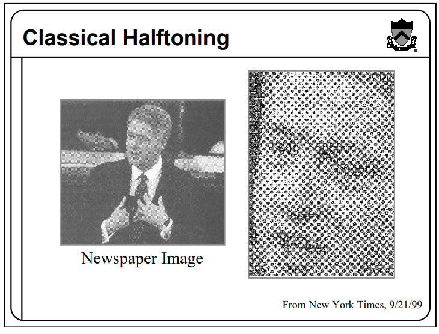
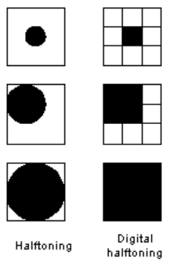
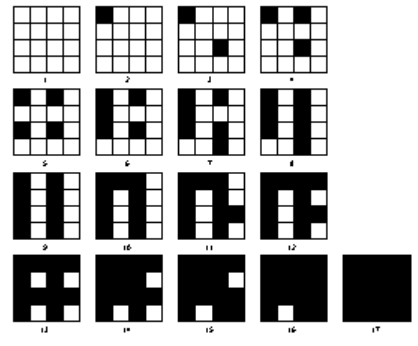
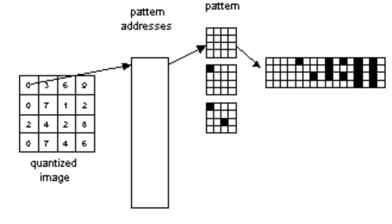
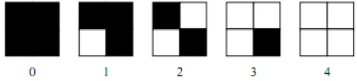
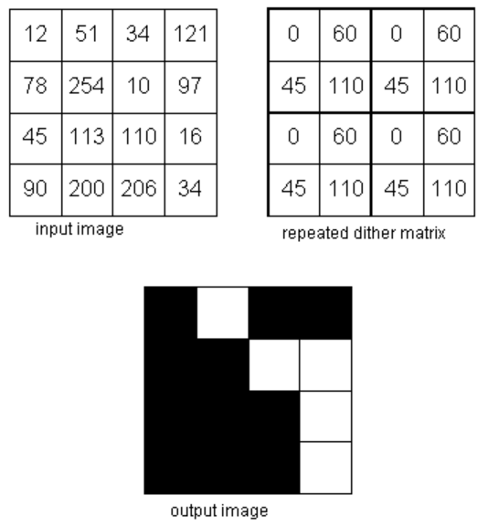

# NIM   :2110131220011
# NAMA  :Egyn T. Nadia

## Tugas 3.2 Pemrosesan Citra Digital

<h3><b> Halftoning</b></h3>

Digital halftoning adalah suatu proses untuk menyebarkan citra yang kontinu kedalam suatu array merupakan titik-titik. 
Halftoning mencoba untuk memberikan kesan warna biner tampak seperticitra abu-abu sementara hanya menggunakan piksel warna hitam dan putih saja. Meskiteknik ambang batas (ambang batas) yang sederhana ini dapat mengubah citra abu-abu menjadi citra biner, namun kualitas citra yang dihasilkan masih kurang baik. UntukMemperbaiki keterbatasan ini, pada tulisan ini akan menonaktifkan citra biner yangmenggunakan metode dithering.

<h3><b> patterning</b></h3>

Patterning adalah cara paling sederhana untuk menghasilkan gambar halftoning digital. Ini menghasilkan gambar yang memiliki resolusi spasial lebih tinggi daripada gambar sumber. Jumlah sel halftone citra keluaran sama dengan jumlah piksel citra sumber. Namun, setiap sel halftone dibagi lagi menjadi kotak 4x4. Setiap nilai piksel input diwakili oleh jumlah kotak terisi yang berbeda dalam sel halftone.

<h3><b>Dithering</b></h3>

Dithering dilakukan dengan membandingkan setiap blok dari citra asli dengan sebuahmatriks pembatas yang disebut dengan matriks dither. Masing-masing elemen dari blok aslidikuantisasi sesuai dengan nilai batas pada pola dither. Nilai-nilai pada matriks dither adalahtetap, tetapi bisa bervariasi sesuai dengan jenis citra.

