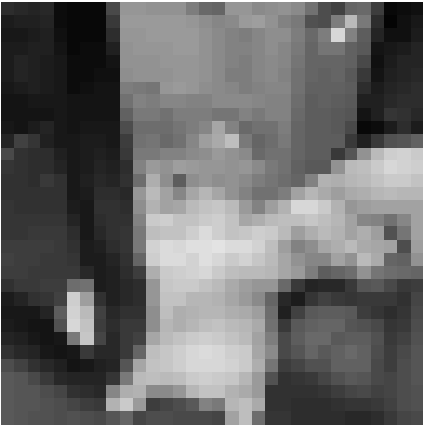

# NIM   :2110131220011
# NAMA  :Egyn T. Nadia

## Tugas 3 Pemrosesan Citra Digital
 

<h3><b>1. Lightness</b></h3>

Algoritmanya adalah mencari nilai tertinggi dan terendah dari nilai R G B, kemudian nilai tertinggi dan terendah tersebut dijumlahkan lantas dikalikan dengan 0.5. Secara matematis dapat dirumuskan : 
Grayscale = (max(R,G,B)) + (min(R,G,B)) / 2
 

<h3><b>2. Average</b></h3>

Algoritmanya adalah dengan menjumlahkan seluruh nilai R G B, kemudian dibagi 3, sehingga diperoleh nilai rata-rata dari R G B, nilai rata-rata itulah yang dapat dikatakan sebagai grayclase. Rumus matematisnya adalah : 
Grayscale = (R + G + B) / 3

<h3><b>3. Luminosity</b></h3>

Algoritmanya adalah dengan mengalikan setiap nilai R G B dengan konstanta tertentu yang sudah ditetapkan nilainya, kemudian hasil perkalian seluruh nilai R G B dijumlahkan satu sama lain. Rumus matematisnya adalah : 
Grayscale = (0.3*R)+(0.59*G)+(0.11*B)

