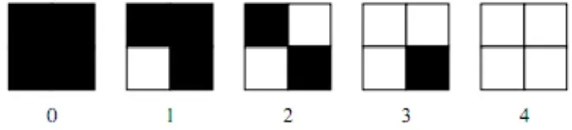

# NIM   :2110131220011
# NAMA  :Egyn T. Nadia

## Tugas 4.1 
## MENENTUKAN POLA PADA PATTERNING DAN DITHERNING

 
<h2 align = "center">DITHERING</h2>

 Dengan menggunakan matriks 2x2 piksel, lima nilai intensitas "efektif" yang berbeda dapat terwakili. Demikian dengan matriks 4x4 piksel, sepuluh buah tingkat kabuan yang berbeda dapat terwakili. Metode ini disebut dengan <i>dithering</i>, dalam proses <i>dithering</i> blok asli pada citra kemudian akan diganti dengan jenis pola biner.

<i>Ordered dithering</i> dilakukan dengan membandingkan tiap blok dari citra asli dengan sebuah matriks pembatas yang disebut dengan matriks <i>dither</i>. Masing-masing elemen dari blok asli dikuantisasi sesuai dengan nilai batas pada <i>dither</i>. Nilai-nilai pada matriks <i>dither</i> adalah tetap, tetapi bisa bervariasi sesuai dengan jenis citra. 
Matriks <i>dither</i> pertama yang digunakan dalam metode ini adalah:

Matrik tersebut diulang sampai mencakup seluruh matrik pada citra yang diolah. Katakanlah d(i,j) adalah matrik yang diperoleh dari mereplika A dan x(i,j) adalah citra abu-abu asli. Piksel untuk citra yang dihasilkan p(i,j) didefinisikan sebagai berikut:

Hasil konversi citra abu-abu pada gambar menggunakan metode <i>ordered dithering</i> menggunakan matriks <i>dither</i> 2x2

Citra keluaran dari proses <i>ordered dithering</i> menunjukkan kualitas yang lebih baik dibandingkan dengan metode ambang batas (<i>thresholding</i>). Perbedaan antara keluaran yang dihasilkan antara citra menggunakan 2x2 matriks <i>dithering</i> dan 4x4 matrik <i>dithering</i> terletak pada sensitifitas nlai piksel aslinya. Citra yang dihasilkan dari mpenggunaan matrik 2x2 memiliki pola <i>halftone</i> yang kurang dibandingkan dengan citra yang diproses menggunakan matriks <i>dithering</i> 4x4. Karena itu hasil dari citra dengan 2x2 matriks <i>dithering</i> memiliki banyak daerah dengan pola yang sama, seperti pada bagian latar belakang, rambut, dan hidung, meskipun pada daerah ini mengandung lebih banyak jenis piksel.

 
<h2 align = "center">PATTERNING</h2>