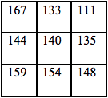
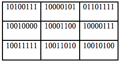
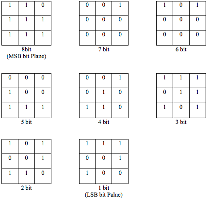
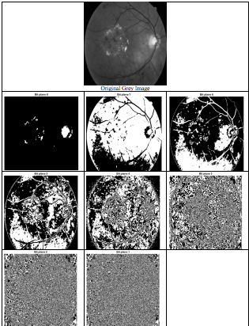

# NIM   :2110131220011
# NAMA  :Egyn T. Nadia

## Pseudocode Bit Plane Slicing

Gambar 8 bit "0" dikodekan dalam 00000000 dan "255" dikodekan dalam 11111111. 
Terapkan bit plane slicing pada ukuran gambar berikut (3X3)

Lalu ubah format kedalam bentuk biner 

Bit plane slicing dari contoh diatas

