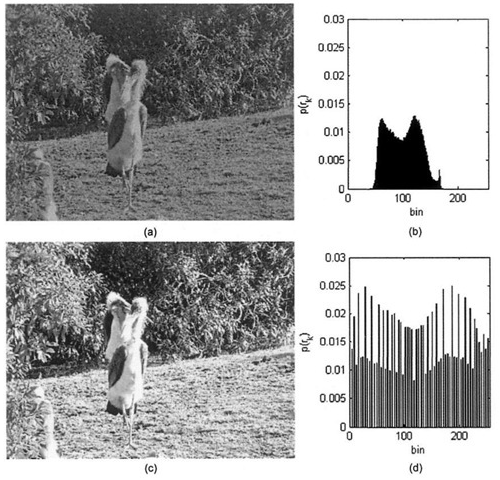

# NIM   :2110131220011
# NAMA  :Egyn T. Nadia

## Pseudocode Histogram Equalization

 Histogram equalization adalah untuk meningkatkan penyebaran histogram. Jika histogram mewakili citra digital, maka dengan menyebarkan nilai intensitas pada rentang dinamis yang besar, kita dapat meningkatkan kontras citra.

(a) Gambar asli burung di Kebun Binatang San Francisco. (b) Histogram yang belum diproses, (c) Histogram gambar burung yang disamakan, (d) Histogram yang disamakan, menunjukkan aproksimasi terhadap distribusi seragam di seluruh rentang [0-255] 

- Temukan frekuensi setiap nilai yang diwakili pada sumbu horizontal histogram yaitu intensitas dalam kasus gambar.
- Hitung fungsi kepadatan probabilitas untuk setiap nilai intensitas.
- Setelah menemukan PDF, hitung fungsi kepadatan kumulatif untuk setiap frekuensi intensitas.
- Nilai CDF berada pada rentang 0-1, jadi kita kalikan semua nilai CDF dengan nilai intensitas terbesar yaitu 255.
- Bulatkan nilai akhir menjadi nilai integer.
 

