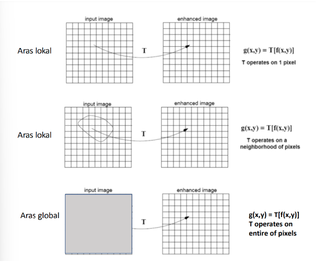
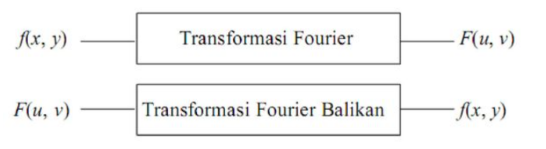

# NIM   :2110131220011
# NAMA  :Egyn T. Nadia

## Spatial Domain dan Frequency Domain 

Pengertian dari proses peningkatan kualitas citra berdasarkan ranah operasinya yaitu: 
1. Domain Spasial : Peningkatan ruang gambar yang membagi gambar menjadi piksel yang seragam sesuai dengan koordinat spasial dengan resolusi tertentu. Metode domain spasial melakukan operasi pada piksel secara langsung. 
2. Domain Frekuensi : Peningkatan yang diperoleh dengan menerapkan transformasi Fourier ke domain spasial. Dalam domain frekuensi, piksel dioperasikan dalam kelompok dan juga secara tidak langsung.

### 1. Domain Spatial (Image enhancement dalam ranah spatial)

Metode-metode Image Enhancement dalam ranah spasial dilakukan dengan memanipulasi secara langsung pixel-pixel di dalam citra. Domain spasial melibatkan operasi konvolusi, sehingga komputasinya lebih tinggi dan prosesnya lebih kompleks. 

Metode pemrosesan citra dalam ranah ini dinyatakan sebagai :

                  g(x, y) = T[f(x, y)]

Keterangan :

f(x, y) = Citra original/citra input 
g(x, y) = Citra baru yang dimodifikasi/citra output 
T = Sebuah transformasi yang diterapkan untuk mendapatkan citra baru (g(x,y)) 
Untuk citra 8-bit, f dapat mengambil nilai dari 0-255 yang dimana 0 adalah hitam dan 255 adalah putih. T bisa beroperasi pada satu pixel, sekelompok pixel bertetangga, atau keseluruhan pixel di dalam citra. Jadi, metode dalam ranah spasial dapat dilakukan pada aras titik(pixel), aras lokal, dan aras global. Untuk lebih jelas, lihat ilustrasi berikut.

#### Metode Domain Spasial

Terdapat 2 metode untuk perbaikan kualitas citra (image enhancement) pada domain spasial, yaitu :

1. Point Processing
2. Mask Processing

<h3>Point Processing</h3>
Cara paling mudah untuk melakukan peningkatan mutu pada domain spatial adalah dengan melakukan pemrosesan yang hanya melibatkan satu piksel saja (tidak menggunakan jendela ketetanggaan). Pengolahan menggunakan histogram juga termasuk dalam bagian point processing. Operasi titik disebut juga operasi pointwise, yang terdiri dari pengaksesan pixel pada lokasi yg diberikan, memodifikasinya dengan operasi linier atau non linier, menempatkan nilai piksel baru pada lokasi yang bersesuaian di dalam citra yg baru.

Operasi ini dapat dibagi menjadi 3 macam :

Berdasarkan intensitas --> Contrast stretching, Image Negative, Histogram equalization, Image Substration, Image Averaging.

Berdasarkan geometri --> Posisi pixel diubah ke posisi yg baru, sedangkan intensitasnya tidak berubah. Contoh : rotasi, translasi, penskalaan (dilatasi), distorsigeometri.

Gabungan keduanya --> Operasi ini tidak hanya mengubah nilai intensitas pixel, tapi juga mengubah posisinya. Misal: image morphing yaitu perubahan bentuk objek beserta intensitasnya.

<h3>Mask Processing</h3>

Jika pada point processing kita hanya melakukan operasi terhadap masing-masing piksel, maka pada mask processing kita melakukan operasi terhadap suatu jendela ketetanggaan pada citra. Kemudian kita menerapkan (mengkonvolusikan) suatu mask terhadap jendela tersebut. Masksering juga disebut filter. Filtering pada citra adalah suatu proses dimana diambil sebagian sinyal dari frekuensi tertentu dan membuang sinyal pada frekuensi yang lain.

### 2. Domain Frequency (Image enhancement dalam ranah frekuensi)

Metode-metode Image Enhancement dalam ranah frekuensi dilakukan dengan mengubah citra terlebih dahulu dari ranah spasial ke ranah frekuensi, baru kemudian memanipulasi nilai-nilai frekuensi tersebut. Domain frekuensi hanya dapat dilakukan pada aras global dan tidak melibatkan operasi konvolusi, sehingga komputasinya rendah cepat dan prosesnya relatif simple.

Prose perubahan fungsi dari ranah spasial ke dalam ranah frekuensi dilakukan melalui Transformasi Fourier. Sedangkan perubahan fungsi dari ranah frekuensi ke ranah spasial dilakukan melalui Transformasi Fourier Balikan (invers).

